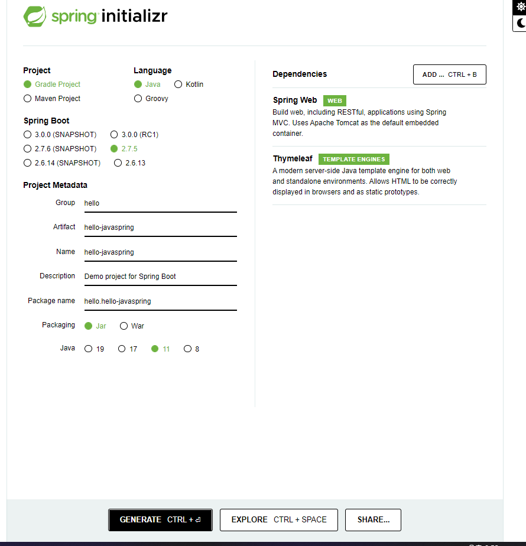
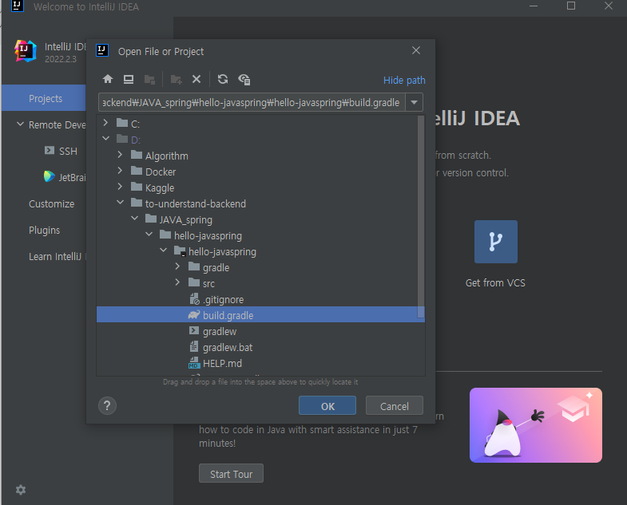
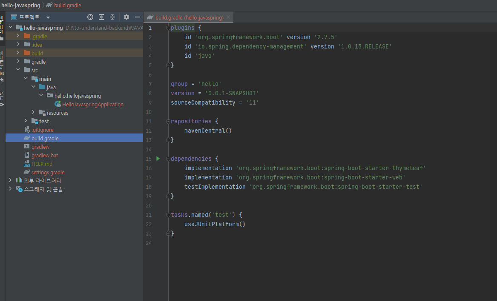
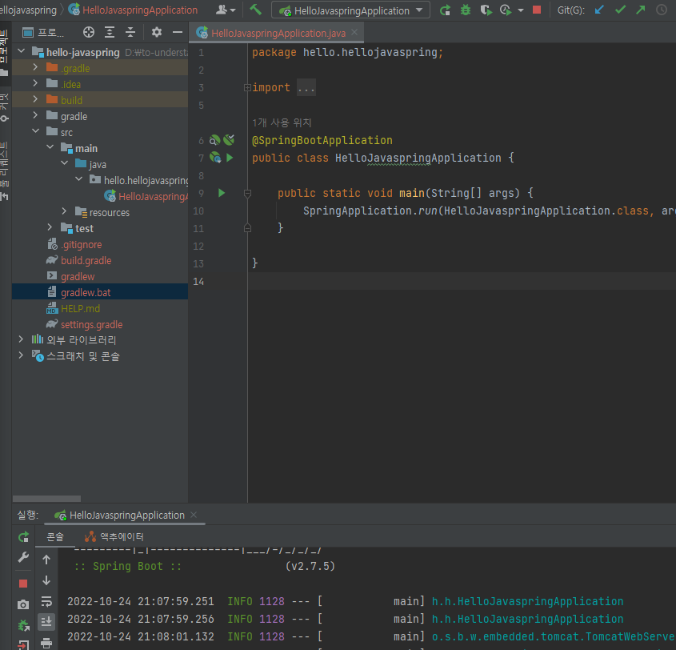
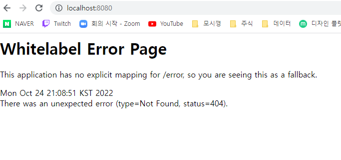
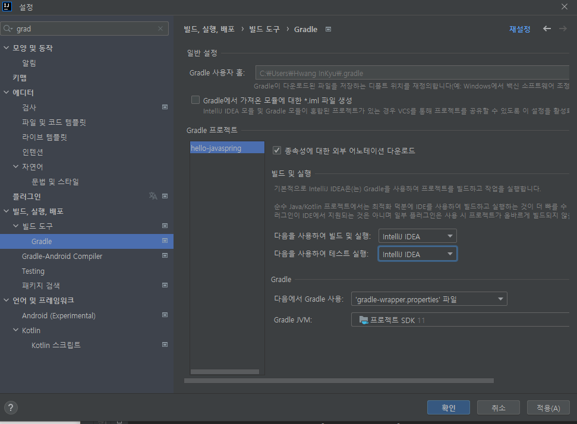

## 시작하기

https://start.spring.io/ 에서 스프링 프로젝트 만들기

- gradle을 많이 사용하는 추세이다.

 인텔리제이에서 오픈을 선택 후

## grable

gradle은 나중에 깊이보자 지금은 버전설정하고 라이브러리 땡겨오는 구나만 알자

dependencies는 스프링 io에서 땡겨온 라이브러리들이 있다.

여기에 체스트용 라이브러리는 기본으로 따라들어온다.

mavenCentral에서 라이브러리 다운받으란게 reporitories의 내용이다.

## HelloJavaspringApplication.java

## 번외 설정

