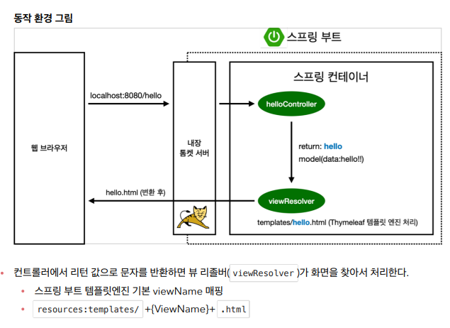

## welcome page 만들기

recources/static/index.html에 추가

```html
<html>
<head>
    <title>Hello</title>
    <meta http-equiv="Content-Type" content="text/html; charset=UTF-8" />
</head>
<body>
Hello
<a href="/hello">hello</a>
</body>
</html>
```

- 스프링 부트가 제공하는 Welcome Page 기능
  - `static/index.html` 을 올려두면 Welcome page 기능을 제공한다
  - [Spring Boot Features](https://docs.spring.io/spring-boot/docs/2.3.1.RELEASE/reference/html/spring-boot-features.html#boot-features-spring-mvc-welcome-page)
    - https://spring.io/에서 프로젝트에 스프링 부트로 들어가면 동일 함

## thymeleaf 템플릿 엔진

- thymeleaf 공식 사이트: https://www.thymeleaf.org/ 
- 스프링 공식 튜토리얼: https://spring.io/guides/gs/serving-web-content/ 
- 스프링부트 메뉴얼: https://docs.spring.io/spring-boot/docs/2.3.1.RELEASE/reference/html/spring-boot-features.html#boot-features-spring-mvc-template-engines

hellojavaspring 아래controller 파일을 만들고 HelloController클래스 만들기

```java
package hello.hellojavaspring.controller;

import org.springframework.stereotype.Controller;
import org.springframework.ui.Model;
import org.springframework.web.bind.annotation.GetMapping;

@Controller
public class HelloController {
    @GetMapping
    public String hello(Model model){
        model.addAttribute("data", "hello!!");
        return "hello";
    }
}
```

- @Conyroller을 입력시 import org.springframework.stereotype.Controller;가 자동으로  입력된다.
- @GetMapping을 입력시 import org.springframework.web.bind.annotation.GetMapping;가 자동으로 입력된다.

`resources/templates/hello.html`

```html
<html xmlns:th="http://www.thymeleaf.org">
<!--th는 타임리프 앤진을 의미한다.-->
<head>
    <title>Hello</title>
    <meta http-equiv="Content-Type" content="text/html; charset=UTF-8" />
</head>
<body>
<p th:text="'안녕하세요. ' + ${data}" >안녕하세요. 손님</p>
</body>
</html>
```



-  참고: spring-boot-devtools 라이브러리를 추가하면, html 파일을 컴파일만 해주면 서버 재시작 없이 View 파일 변경이 가능하다.
-  인텔리J 컴파일 방법: 메뉴 build Recompile

### MVC

- https://developer.mozilla.org/ko/docs/Glossary/MVC 참고

**MVC** (모델-뷰-컨트롤러) 는 **사용자 인터페이스**, **데이터 및 논리 제어**를 **구현**하는데 사용되는 소프트웨어 **디자인 패턴**이다.

