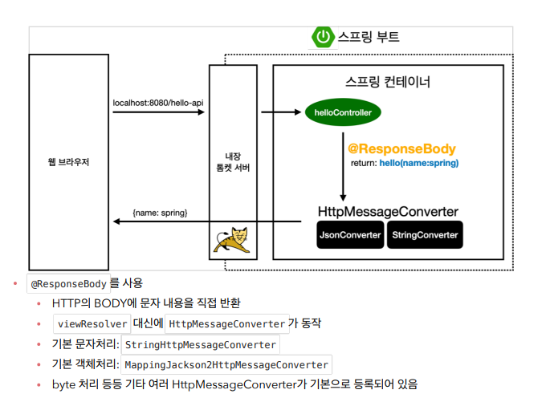

# 스프링 개발 기초

- 정적 컨텐프
- MVC와 템플릿 엔진
- API

## 정적 컨텐츠

- 스프링 부트 정적 컨텐츠 기능
- https://docs.spring.io/spring-boot/docs/2.3.1.RELEASE/reference/html/spring-bootfeatures.html#boot-features-spring-mvc-static-content

`resources/static/hello-static.html`파일 만들기

```html
<!DOCTYPE HTML>
<html>
<head>
    <title>static content</title>
    <meta http-equiv="Content-Type" content="text/html; charset=UTF-8" />
</head>
<body>
정적 컨텐츠 입니다.
</body>
</html>
```


## MVC와 템플릿 엔진

**Controller**

```java
@Controller
public class HelloController {
 @GetMapping("hello-mvc")
 public String helloMvc(@RequestParam("name") String name, Model model) {
 model.addAttribute("name", name);
 return "hello-template";
 }
}
```

**View**

`resources/templates/hello-template.html`

```html
<html xmlns:th="http://www.thymeleaf.org">
<body>
<p th:text="'hello ' + ${name}">hello! empty</p>
</body>
</html>
```


## API

### @ResponseBody 문자 반환

```java
@Controller
public class HelloController {
 @GetMapping("hello-string")
 @ResponseBody
 public String helloString(@RequestParam("name") String name) {
 return "hello " + name;
 }
}
```

- @ResponseBody 를 사용하면 뷰 리졸버( viewResolver )를 사용하지 않음 
- 대신에 HTTP의 BODY에 문자 내용을 직접 반환(HTML BODY TAG를 말하는 것이 아님)

### @ResponseBody 객체 반환

```java
@Controller
public class HelloController {
 @GetMapping("hello-api")
 @ResponseBody
 public Hello helloApi(@RequestParam("name") String name) {
 Hello hello = new Hello();
 hello.setName(name);
 return hello;
 }
 static class Hello {
 private String name;
 public String getName() {
 return name;
 }
 public void setName(String name) {
 this.name = name;
 }
 }
}
```

- @ResponseBody 를 사용하고, 객체를 반환하면 객체가 JSON으로 변환됨

