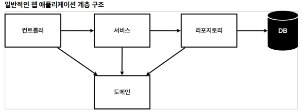
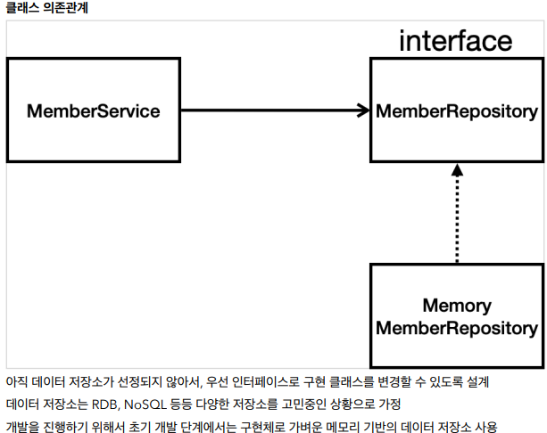

# 회원관리예제

## 비즈니스 요구사항

- 데이터: 회원 ID, 이름
- 기능: 회원 등록, 조회
- 아직 데이터 저장소가 선정되지 않은 상태(가상시나리오)



- 컨트롤러: 웹 MVC의 컨트롤러 역할
- 서비스: 핵심 비즈니스 로직 구현
- 리포지토리: 데이터베이스에 접근, 도메인 객체를 DB에 저장하고 관리
- 도메인: 비즈니스 도메인 객체, 예) 회원, 주문, 쿠폰 등등 주로 데이터베이스에 저장하고 관리됨



## 회원 도메인과 리포지토리 만들기

### 회원 객체

`hellojavaspring`에 `domain`파일을 만들고 그 안에 Member클래스 만들기

```java
package hello.hellojavaspring.domain;

public class Member {

    private Long id;
    private  String name;
    //Alt+ Insert 눌러서
    public Long getId() {
        return id;
    }

    public void setId(Long id) {
        this.id = id;
    }

    public String getName() {
        return name;
    }

    public void setName(String name) {
        this.name = name;
    }
}
```

### 회원 리포지토리 인터페이스

`hellojavaspring`에 `repository`파일을 만들고 그 안에 `MemberRepository`인터페이스 만들기

- 인터페이스를 쓰는 이유:

```java
package hello.hellojavaspring.repository;

import hello.hellojavaspring.domain.Member;

import java.util.List;
import java.util.Optional;

public interface MemberRepository {
    Member save(Member member);
    Optional<Member> findById(Long id);
    Optional<Member> findByName(String name);
    List<Member> findAll();

    void clearStore();
}
```

### 회원 리포지토리 메모리 구현체

`repository`에 `MemoryMemberRepository`클래스 만들기

```java
package hello.hellospring.repository;
import hello.hellospring.domain.Member;
import java.util.*;
/**
 * 동시성 문제가 고려되어 있지 않음, 실무에서는 ConcurrentHashMap, AtomicLong 사용 고려
 */
public class MemoryMemberRepository implements MemberRepository {
 private static Map<Long, Member> store = new HashMap<>();
 private static long sequence = 0L;
 @Override
 public Member save(Member member) {
 member.setId(++sequence);
 store.put(member.getId(), member);
 return member;
 }
 @Override
 public Optional<Member> findById(Long id) {
 return Optional.ofNullable(store.get(id));
 }
 @Override
 public List<Member> findAll() {
 return new ArrayList<>(store.values());
 }
 @Override
 public Optional<Member> findByName(String name) {
 return store.values().stream()
 .filter(member -> member.getName().equals(name))
 .findAny();
 }
 public void clearStore() {
 store.clear();
 }
}
```

## 회원 리포지토리 테스트 케이스 작성


자바는 **JUnit**이라는 프레임워크로 테스트를 실행하여 **오래 걸리고 반복하기 어려운** 문제를 해결한다.

 **JUnit이 사용 불가능** 하다면 자바의 **main 메서드**를 통해서 실행하거나, 웹 애플리케이션의 **컨트롤러를 통해서** 해당 기능을 실행


`src/test/java` 하위 폴더에 생성한다.

```java
package hello.hellojavaspring.repository;

import hello.hellojavaspring.domain.Member;
import org.assertj.core.api.Assertions;
import org.junit.jupiter.api.AfterEach;
import org.junit.jupiter.api.Test;

import java.awt.*;
import java.util.List;

class MemoryMemberRepositoryTest {

    MemberRepository repository = new MemoryMemberRepository();
    @AfterEach
    public void afterEach(){
        repository.clearStore();

    }

    @Test
    public void save(){
        Member member = new Member();
        member.setName("spring");

        repository.save(member);
        Member result = repository.findById(member.getId()).get();

        System.out.println("result ="+(result == member));
        //방법1
//        Assertions.assertEquals(member, result);
        //jupiter
        //방법2
        Assertions.assertThat(member).isEqualTo(result);
        //assertj.core
    }
    @Test
    public void findByName(){
        //given
        Member member1 = new Member();
        member1.setName("spring1");
        repository.save(member1);

        Member member2 = new Member();
        member2.setName("spring2");
        repository.save(member2);

        Member result = repository.findByName("spring1").get();
        Assertions.assertThat(result).isEqualTo(member1);
    }

    @Test
    public void findAll() {
        //given
        Member member1 = new Member();
        member1.setName("spring1");
        repository.save(member1);
        Member member2 = new Member();
        member2.setName("spring2");
        repository.save(member2);
        //when
        List<Member> result = repository.findAll();
        //then
        Assertions.assertThat(result.size()).isEqualTo(2);

    }
}

```

- **@AfterEach** : 한번에 여러 테스트를 실행하면 메모리 DB에 직전 테스트의 결과가 남을 수 있다. 이렇게 되면 다음 이전 테스트 때문에 다음 테스트가 실패할 가능성이 있다. @AfterEach 를 사용하면 각 테스트가 종료될 때 마다 이 기능을 실행한다. 여기서는 메모리 DB에 저장된 데이터를 삭제한다. 
- 테스트는 각각 독립적으로 실행되어야 한다. 테스트 순서에 의존관계가 있는 것은 좋은 테스트가 아니다.

## 회원 서비스 개발

`hellojavaspring`파일에 `service`파일을 만들고 `MemberService`클래스를 만든다.

```java
package hello.hellospring.service;
import hello.hellospring.domain.Member;
import hello.hellospring.repository.MemberRepository;
import java.util.List;
import java.util.Optional;
public class MemberService {
 private final MemberRepository memberRepository = new
MemoryMemberRepository();
 /**
 * 회원가입
 */
 public Long join(Member member) {
 validateDuplicateMember(member); //중복 회원 검증
 memberRepository.save(member);
 return member.getId();
 }
 private void validateDuplicateMember(Member member) {
 memberRepository.findByName(member.getName())
 .ifPresent(m -> {
 throw new IllegalStateException("이미 존재하는 회원입니다.");
 });
 }
 /**
 * 전체 회원 조회
 */
 public List<Member> findMembers() {
 return memberRepository.findAll();
 }
 public Optional<Member> findOne(Long memberId) {
 return memberRepository.findById(memberId);
 }
}
```

## 회원 서비스 테스트

**기존에는 회원 서비스가 메모리 회원 리포지토리를 직접 생성하게 했다.**

```java
public class MemberService {
 private final MemberRepository memberRepository = 
 new MemoryMemberRepository();
}
```

**회원 리포지토리의 코드가 회원 서비스 코드를 DI 가능하게 변경한다.**

```java
public class MemberService {
 private final MemberRepository memberRepository;
 public MemberService(MemberRepository memberRepository) {
 this.memberRepository = memberRepository;
 }
 ..
```

### 테스트

```java
package hello.hellospring.service;
import hello.hellospring.domain.Member;
import hello.hellospring.repository.MemoryMemberRepository;
import org.junit.jupiter.api.BeforeEach;
import org.junit.jupiter.api.Test;
import static org.assertj.core.api.Assertions.*;
import static org.junit.jupiter.api.Assertions.*;
class MemberServiceTest {
 MemberService memberService;
 MemoryMemberRepository memberRepository;
 @BeforeEach
 public void beforeEach() {
 memberRepository = new MemoryMemberRepository();
 memberService = new MemberService(memberRepository);
 }
 @AfterEach
 public void afterEach() {
 memberRepository.clearStore();
 }
 @Test
 public void 회원가입() throws Exception {
 //Given
 Member member = new Member();
 member.setName("hello");
 //When
 Long saveId = memberService.join(member);
 //Then
 Member findMember = memberRepository.findById(saveId).get();
 assertEquals(member.getName(), findMember.getName());
 }
 @Test
 public void 중복_회원_예외() throws Exception {
 //Given
 Member member1 = new Member();
 member1.setName("spring");
 Member member2 = new Member();
 member2.setName("spring");
 //When
 memberService.join(member1);
 IllegalStateException e = assertThrows(IllegalStateException.class,
 () -> memberService.join(member2));//예외가 발생해야 한다.
 assertThat(e.getMessage()).isEqualTo("이미 존재하는 회원입니다.");
 }
}
```

- `@BeforeEach` : 각 테스트 실행 전에 호출된다. 테스트가 서로 영향이 없도록 항상 새로운 객체를 생성하고,  의존관계도 새로 맺어준다.