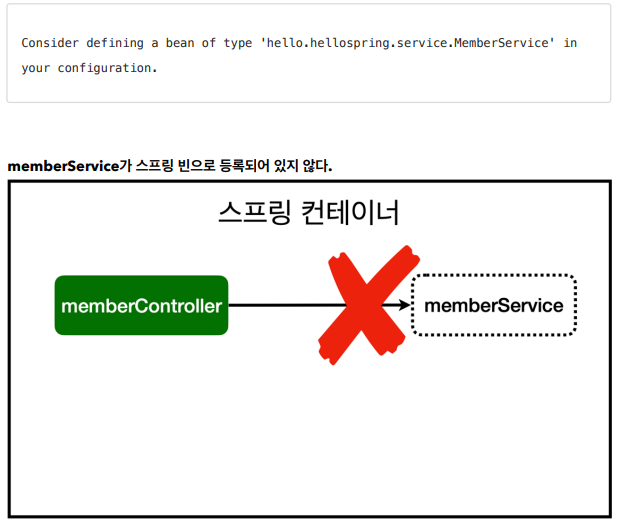
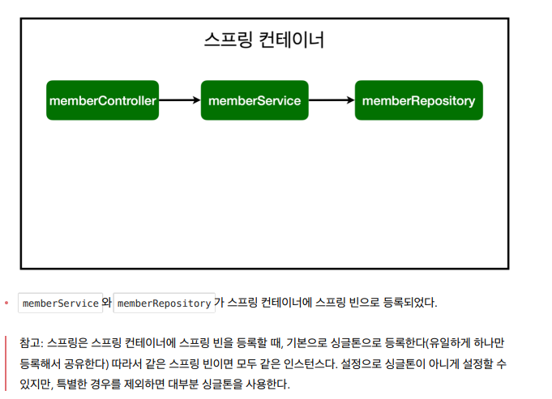

# 스피링 빈과 의존관계

## 컴포넌트 스캔과 자동 의존관계 설정

회원 컨트롤가 회원서비스와 화원 리포지토리를 사용할 구 있게 의존관계를 준비하자.

**회원 컨트롤러에 의존관계 추가**

```java
package hello.hellospring.controller;
import hello.hellospring.service.MemberService;
import org.springframework.beans.factory.annotation.Autowired;
import org.springframework.stereotype.Controller;
@Controller
public class MemberController {
 private final MemberService memberService;
 @Autowired
 public MemberController(MemberService memberService) {
 this.memberService = memberService;
 }
}
```

- 생성자에 @Autowired 가 있으면 스프링이 연관된 객체를 스프링 컨테이너에서 찾아서 넣어준다. 이렇게 객체 의존관계를 외부에서 넣어주는 것을 DI (Dependency Injection), 의존성 주입이라 한다.

**오류 발생**



### 스프링 빈을 등록하는 2가지 방법

- 컴포넌트 스캔과 자동 의존관계 설정 
- 자바 코드로 직접 스프링 빈 등록하기

### 컴포넌트 스캔 원리

- @Component 애노테이션이 있으면 스프링 빈으로 자동 등록된다. 
- @Controller 컨트롤러가 스프링 빈으로 자동 등록된 이유도 컴포넌트 스캔 때문이다. 


- @Component 를 포함하는 다음 애노테이션도 스프링 빈으로 자동 등록된다. 
  - **@Controller** 
  - **@Service** 
  - **@Repository**

### 회원 서비스 스프링 빈 등록

```java
@Service
public class MemberService {
 private final MemberRepository memberRepository;
 @Autowired
 public MemberService(MemberRepository memberRepository) {
 this.memberRepository = memberRepository;
 }
}
```

### 회원 리포지토리 스프링 빈 등록

```java
@Repository
public class MemoryMemberRepository implements MemberRepository {}
```



## 자바 코드로 직접 스프링 빈 등록하기

- 회원 서비스와 회원 리포지토리의 @Service, @Repository, @Autowired 애노테이션을 제거하고 진행한다

```java
package hello.hellospring;
import hello.hellospring.repository.MemberRepository;
import hello.hellospring.repository.MemoryMemberRepository;
import hello.hellospring.service.MemberService;
import org.springframework.context.annotation.Bean;
import org.springframework.context.annotation.Configuration;
@Configuration
public class SpringConfig {
 @Bean
 public MemberService memberService() {
 return new MemberService(memberRepository());
 }
 @Bean
 public MemberRepository memberRepository() {
return new MemoryMemberRepository();
 }
}
```

